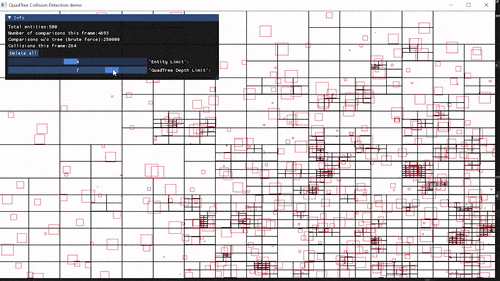

# QuadTree demo

## [Here's a link to a video of the demo.](https://youtu.be/rHf6aKyx8l8)

My first implementation of a QuadTree. Wanted to learn about spatial data structures for use in game development, so I created a demo of large amounts of collisions occurring utilizing this data structure.

First time using [Dear ImGui](https://github.com/ocornut/imgui). Want to use in future projects to thought this would be a good example project to use it with. With it you can control parameters of the QuadTree & delete all current entities. It also shows information relevant to the demo.
